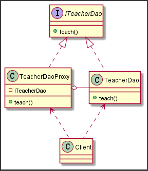
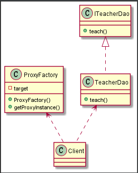
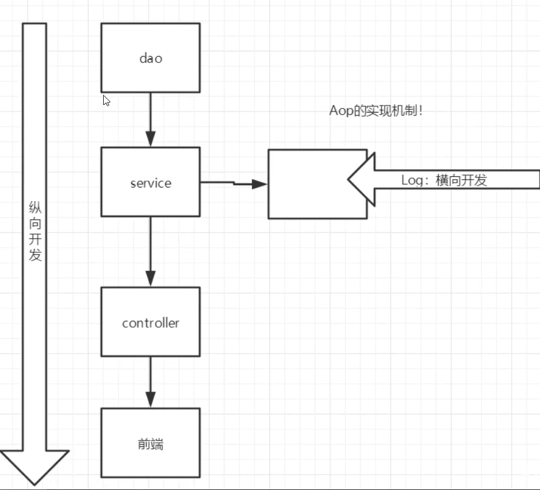
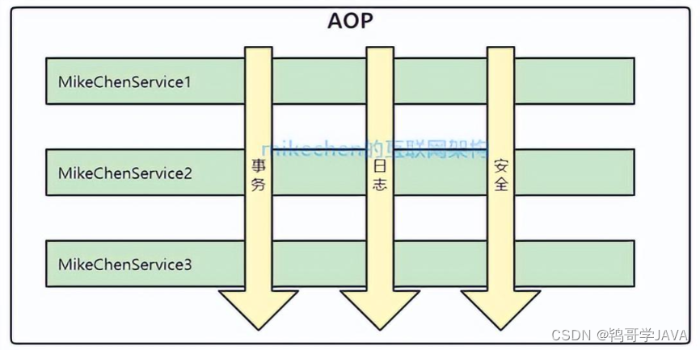
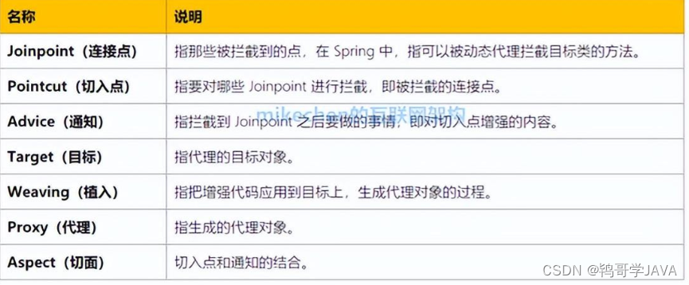
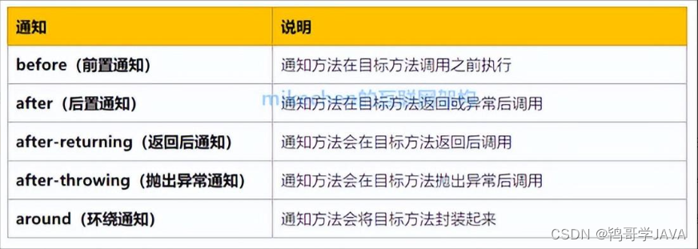
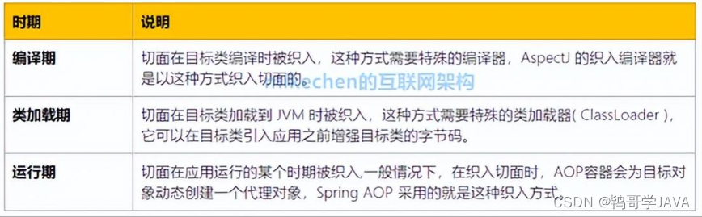

## 1、Spring5

### 1.1简介

Spring是一个分层的Java SE/EE应用一站式的**轻量级开源框架**。**Spring核心是IOC和AOP。**（**控制反转和面向切面编程**）

Spring主要优点包括：

* 方便解耦，简化开发，通过Spring提供的IoC容器，我们可以将对象之间的依赖关系交由Spring进行控制，避免硬编码造成的程序耦合度高。
* AOP编程的支持，通过Spring提供的AOP功能，方便进行面向切面编程。
* 声明式事务的支持，在Spring中，我们可以从单调烦闷的事务管理代码中解脱出来，通过声明式方式灵活地进行事务的管理，提高开发效率和质量。
* 方便程序的测试，可以用非容器依赖的编程方式进行几乎所有的测试工作
* **方便集成各种优秀框架**，Spring提供了对各种优秀框架的直接支持。

官网：[Spring Framework](https://spring.io/projects/spring-framework)


```
<dependency>
    <groupId>org.springframework</groupId>
    <artifactId>spring-web</artifactId>
    <version>5.3.24</version>
</dependency>

<dependency>
    <groupId>org.springframework</groupId>
    <artifactId>spring-jdbc</artifactId>
    <version>5.3.24</version>
</dependency>
```


### 1.2组成


**核心容器（Spring Core）**

　　核心容器提供Spring框架的基本功能。Spring以bean的方式组织和管理Java应用中的各个组件及其关系。Spring使用BeanFactory来产生和管理Bean，它是工厂模式的实现。BeanFactory使用控制反转(IoC)模式将应用的配置和依赖性规范与实际的应用程序代码分开。

**应用上下文（Spring Context）**

　　Spring上下文是一个配置文件，向Spring框架提供上下文信息。Spring上下文包括企业服务，如JNDI、EJB、电子邮件、国际化、校验和调度功能。

**Spring面向切面编程（Spring AOP）**

　　通过配置管理特性，Spring AOP 模块直接将面向方面的编程功能集成到了 Spring框架中。所以，可以很容易地使 Spring框架管理的任何对象支持 AOP。Spring AOP 模块为基于 Spring 的应用程序中的对象提供了事务管理服务。通过使用 Spring AOP，不用依赖 EJB 组件，就可以将声明性事务管理集成到应用程序中。

**JDBC和DAO模块（Spring DAO）**

　　JDBC、DAO的抽象层提供了有意义的异常层次结构，可用该结构来管理异常处理，和不同数据库供应商所抛出的错误信息。异常层次结构简化了错误处理，并且极大的降低了需要编写的代码数量，比如打开和关闭链接。

**对象实体映射（Spring ORM）**

　　Spring框架插入了若干个ORM框架，从而提供了ORM对象的关系工具，其中包括了Hibernate、JDO和 IBatis SQL Map等，所有这些都遵从Spring的通用事物和DAO异常层次结构。

**Web模块（Spring Web）**

　　Web上下文模块建立在应用程序上下文模块之上，为基于web的应用程序提供了上下文。所以Spring框架支持与Struts集成，web模块还简化了处理多部分请求以及将请求参数绑定到域对象的工作。

**MVC模块（Spring Web MVC）**

　　MVC框架是一个全功能的构建Web应用程序的MVC实现。通过策略接口，MVC框架变成为高度可配置的。MVC容纳了大量视图技术，其中包括JSP、POI等，模型来有JavaBean来构成，存放于m当中，而视图是一个街口，负责实现模型，控制器表示逻辑代码，由c的事情。Spring框架的功能可以用在任何J2EE服务器当中，大多数功能也适用于不受管理的环境。Spring的核心要点就是支持不绑定到特定J2EE服务的可重用业务和数据的访问的对象，毫无疑问这样的对象可以在不同的J2EE环境，独立应用程序和测试环境之间重用。


### 1.3拓展

Spring boot

* 快速开发脚手架
* 基于Spring Boot可以快速开发单个微服务
* 约定大于配置

Spring cloud

* 基于spring boot实现的


学习Spring boot的前提是先熟悉掌握Spring和Springmvc


## 2、IOC理论

控制反转

1.使用前，程序主动创建对象，程序控制权在程序员手中

2.使用后，程序被动接受对象，根据对象选择运行流程。


**将主动权交给调用者，程序只负责一个接口。这种思想 , 从本质上解决了问题 , 我们程序员不再去管理对象的创建了 , 更多的去关注业务的实现 . ==耦合性大大降低== . 这也就是IOC的原型**


[(17条消息) 狂神说Spring01：概述及IOC理论推导_狂神博客spring_狂神说的博客-CSDN博客](https://blog.csdn.net/qq_33369905/article/details/106647330)

* 控制反转IoC(Inversion of Control)，是一种设计思想，DI(依赖注入)是实现IoC的一种方法，也有人认为DI只是IoC的另一种说法。没有IoC的程序中 , 我们使用面向对象编程 , 对象的创建与对象间的依赖关系完全硬编码在程序中，对象的创建由程序自己控制，控制反转后将对象的创建转移给第三方，个人认为所谓控制反转就是：获得依赖对象的方式反转了。
* IoC是Spring框架的核心内容，使用多种方式完美的实现了IoC，**可以使用XML配置，也可以使用注解**，新版本的Spring也可以零配置实现IoC
* Spring容器在初始化时先读取配置文件，根据配置文件或元数据创建与组织对象存入容器中，程序使用时再从Ioc容器中取出需要的对象。

* **采用XML方式配置Bean的时候，Bean的定义信息是和实现分离的**，而采用**注解的方式可以把两者合为一体**，Bean的定义信息直接以注解的形式定义在实现类中，从而达到了零配置的目的。


控制反转是一种通过描述（XML或注解）并通过第三方去生产或获取特定对象的方式。在Spring中实现控制反转的是IoC容器，其实现方法是依赖注入（Dependency Injection,DI）。


## 3、HelloSpring

1.实体类

```
package com.rst.pojo;

public class Hello {
    String name;

    public String getName() {
        return name;
    }

    public void setName(String name) {
        this.name = name;
    }

    public void show() {
        System.out.println(name + " hello");
    }
}
```

2.xml配置bean

```
<?xml version="1.0" encoding="UTF-8"?>
<beans xmlns="http://www.springframework.org/schema/beans"
       xmlns:xsi="http://www.w3.org/2001/XMLSchema-instance"
       xsi:schemaLocation="http://www.springframework.org/schema/beans
        https://www.springframework.org/schema/beans/spring-beans.xsd">

    <!--
    使用spring创建对象，id相当于变量名，class就是需要实例化的对象
    -->
    <bean id="hello" class="com.rst.pojo.Hello">
        <!--ref使用的是容器中已经创建好的对象-->
        <property name="name" value="rst"/>
    </bean>

</beans>
```

3.测试

```
import com.rst.pojo.Hello;
import org.springframework.context.ApplicationContext;
import org.springframework.context.support.ClassPathXmlApplicationContext;

public class Mytest {
    public static void main(String[] args) {
        //解析xml文件，获取管理beans的对象
        ApplicationContext context = new ClassPathXmlApplicationContext("ApplicationContext.xml");
        Hello hello = (Hello) context.getBean("hello");
        hello.show();
    }
}
```

这个过程就叫控制反转：

**控制**：谁来控制对象的创建，传统应用程序的对象是由程序本身控制创建的，使用Spring后，对象是由Spring来创建的。

**反转**：程序本身不创建对象，而变成被动的接收对象。

**依赖注入**：就是利用set方法来进行注入的。

IOC是一种编程思想，由主动的编程变成被动的接收。

可以通过new ClassPathXmlApplicationContext去浏览一下底层源码。

**OK，到了现在，我们彻底不用在程序中去改动了，要实现不同的操作，只需要在xml配置文件中进行修改，所谓的IOC，一句话搞定：对象由Spring来创建，管理，装配！**


## 4.IOC创建对象的方式

1.默认使用无参构造

`ApplicationContext context = new ClassPathXmlApplicationContext("ApplicationContext.xml");`获取context对象时就已经创建了所有bean对象

2.使用有参构造

```
<bean id="user" class="com.rst.pojo.User">
    <constructor-arg index="0" value="rst"/>
</bean>
```

```
<bean id="user" class="com.rst.pojo.User">
    <constructor-arg name="name" value="rst"/>
</bean>
```

```
<bean id="user" class="com.rst.pojo.User">
    <constructor-arg type="java.lang.String" value="rst"/>
</bean>
```

3种方法：下标，类型，参数名


注：单例模式，一个对象无论get几次都是同一实例对象。每个对象只创建一个实例


## 5.spring配置

#### 5.1alias别名

```
<alias name="user" alias="rst"/>
```

使原名称或别名都能取到对象


#### 5.2bean配置

> id是bean的唯一标识符
>
> class是类的全限定名：包名+类名
>
> name也是别名，可以同取多个别名 name=“s1,s2 ”


##### scope作用域

Spring容器最初提供了两种bean的scope类型：**singleton**和**prototype**,在Spring2.0之后又引入了另外三种scope类型：**request、session、global session**类型。不过这三种类型有所限制：只能在Web应用中使用。也就是说，只有Web应用的ApplicationContext中使用这三个scope才合理。

> singleton是容器默认的scope，所以写和不写没有区别。scope为singleton的时候，在Spring的IoC容器中只存在一个实例，所有对该对象的引用将共享这个实例。该实例从容器启动，并因为第一次被请求而初始化后，将一直存活到容器退出，也就是说，它与IoC容器“几乎”拥有相同的寿命
> 

> 对于那些请求方不能共享的对象实例，应该将其bean定义的scope设置为prototype。这样，每个请求方可以得到自己对应的一个对象实例。通常，声明为prototype的scope的bean定义类型，都是一些有状态的，比如保存每个顾客信息的对象


#### 5.3import

在团队项目中，可以导入其他人的bean文件。

```
<import resource="bean1.xml"/>
```

可以将所有人的配置文件合并到一个总的xml文件中


## 6.DI依赖注入

依赖：bean依赖于容器创建

注入：bean的属性由容器注入

#### 6.1构造器注入

#### 6.2set方法注入

```xml
<?xml version="1.0" encoding="UTF-8"?>
<beans xmlns="http://www.springframework.org/schema/beans"
       xmlns:xsi="http://www.w3.org/2001/XMLSchema-instance"
       xsi:schemaLocation="http://www.springframework.org/schema/beans
        https://www.springframework.org/schema/beans/spring-beans.xsd">
    <bean id="address" class="com.rst.pojo.Address">
        <property name="address" value="大连海事"/>
    </bean>

    <bean name="p" class="com.rst.pojo.Person" id="person">
        <property name="name" value="任芍廷"/>
        <property name="address" ref="address"/>
        <property name="hobbies">
            <list>
                <value>打篮球</value>
                <value>打游戏</value>
                <value>听音乐</value>
            </list>
        </property>
        <property name="book">
            <map>
                <entry key="红楼梦" value="曹雪芹"/>
                <entry key="西游记" value="吴承恩"/>
            </map>
        </property>
        <property name="properties">
            <props>
                <prop key="id">2002</prop>
                <prop key="name">rst</prop>
            </props>
        </property>
    </bean>
</beans>
```


#### 6.3拓展方法注入

##### p

```xml
xmlns:p="http://www.springframework.org/schema/p"
```

```
<!--p命名注入，直接添加属性，property-->
<bean id="user" class="com.rst.pojo.User" p:id="123" p:pwd="321"/>
```

##### c

```
xmlns:c="http://www.springframework.org/schema/c"
```

```
<!--    c命名注入，相当于简化的构造器注入constructor-arg-->
<bean id="user2" class="com.rst.pojo.User" c:_0="456" c:_1="654"/>
```

##### p和c区别

```xml
p-namespace:通过值进行注入，简洁方便
c-namespace:通过构造器进行注入，需要在java类文件中加上有参构造器和无参构造器

注：p和c命名都与要导入约束
```


## 7.bean自动装配

spring在上下文自动寻找，并自动装配bean属性

3种装配方式

> xml显示配置
>
> java显示配置
>
> **隐式的自动装配bean**


#### 7.1byType和byName

```
<bean id="dog" class="com.rst.pojo.Dog"/>
<bean id="cat" class="com.rst.pojo.Cat"/>

<!--    byType,spring自动寻找上下文中对应的类型-->
<!--    byName，spring寻找id于set后名称相同的类-->
<bean id="p" class="com.rst.pojo.Pepole" autowire="byType"/>
<bean id="p1" class="com.rst.pojo.Pepole" autowire="byName"/>
```


#### 7.2注解实现自动装配

使用须知

1.导入约束 `context`

2.配置支持`registers the following post-processors` `<context:annotation-config/>`

```
<?xml version="1.0" encoding="UTF-8"?>
<beans xmlns="http://www.springframework.org/schema/beans"
	xmlns:xsi="http://www.w3.org/2001/XMLSchema-instance"
	xmlns:context="http://www.springframework.org/schema/context"
	xsi:schemaLocation="http://www.springframework.org/schema/beans
		https://www.springframework.org/schema/beans/spring-beans.xsd
		http://www.springframework.org/schema/context
		https://www.springframework.org/schema/context/spring-context.xsd">

	<context:annotation-config/>

</beans>
```


#### @Autowired

可以直接使用在属性上，因为注解是反射原理，set方法不写也能运行。（ioc容器中自动装配属性符合byName或者byType要求）

```
@Autowired
private Cat cat;
@Autowired
private Dog dog;
```

```
@Autowired
@Qualifier(value="cat")
//Qualifier可以指定容器中bean的id
//两个注解配合使用可以指定一个唯一的bean
```

```
@Autowired(required = false)
//非必须属性可以为null
public void setMovieFinder(@Nullable MovieFinder movieFinder) {
		...
	}
```


## 8.使用注解开发

spring4之后，使用注解，必须要保证aop的包导入了

使用注解要导入约束和配置支持

```
<!--    扫描包，包下的注解就会生效-->
<context:component-scan base-package="com.rst.pojo"/>
<context:annotation-config/>
```


#### @Component

`@Component`放在类前表示被spring管理，就是所谓的bean，不需要在xml中进行声明了。

```
@Component
public class User {
    private String name;

    public String getName() {
        return name;
    }
}
```

#### @Value

```
@Value("rst")
private String name;
//使用注解配置属性
```

#### @Scope

```
@Scope(value = "singleton")
```


#### 衍生注解

@Component有几个衍生注解，我们在web开发中，会按照mvc三层架构分层

* dao @Repository
* service @Service
* controller  @Controller

四个注解功能都是一样的，都是将某个类注册到容器中


小结：

1. xml更加万能，适用场合更广，维护方便
2. 一个类只能配置其自己，不好维护

最佳实践

1. xml来管理bean
2. 注解注入属性


## 9.使用java方式配置spring

完全不用xml配置，全权交由java来实现；

javaConfig是spring的子项目，在4之后成为了核心内容；


#### 实体类

```
package com.rst.pojo;

import org.springframework.beans.factory.annotation.Value;
import org.springframework.stereotype.Component;

@Component
public class User {
    @Value("rst123")
    private String name;

    @Override
    public String toString() {
        return "User{" +
                "name='" + name + '\'' +
                '}';
    }

    public String getName() {
        return name;
    }

    public void setName(String name) {
        this.name = name;
    }
}
```


#### 配置类

```
package com.rst.config;

import com.rst.pojo.User;
import org.springframework.context.annotation.Bean;
import org.springframework.context.annotation.ComponentScan;
import org.springframework.context.annotation.Configuration;
import org.springframework.context.annotation.Import;

@Configuration
@Import(MyConfig2.class)
@ComponentScan("com.rst.pojo")
public class MyConfig {
    @Bean
    public User getUser() {
        return new User();
    }
}
```

@Configuration本质也是一个component，也会被注册到spring容器中


#### 测试

```
import com.rst.config.MyConfig;

import com.rst.pojo.User;
import org.junit.Test;
import org.springframework.context.ApplicationContext;
import org.springframework.context.annotation.AnnotationConfigApplicationContext;

public class MyTest {
    @Test
    public void test1() {
        ApplicationContext context = new AnnotationConfigApplicationContext(MyConfig.class);
        User user = (User) context.getBean("getUser");
        System.out.println(user);
    }
}
```


## 10.代理模式

SpringAOP底层就是代理模式

#### 1.概述

由于某些原因需要给一些对象提供一个代理来控制对该对象的访问。此时，访问对象不是直接访问目标对象而是通过代理对象作为中介进行访问。（类似于租房找中介，中介就相当于代理对象）

Java中的代理按照代理类生成时机不同又分为**静态代理**和**动态代理**。静态代理代理类在编译期生成，而动态代理代理类在Java运行时动态生成。动态代理又有JDK代理 和CGLib代理两种

#### 2.结构

* 抽象主题（Subject）类：通过接口或抽象类声明真实主题和代理对象实现的业务方法。（规定代理类代理目标对象的规则）
* 真实主题（Real Subject）类：实现抽象主题中的具体业务，是代理对象所代表的真实对象，即目标对象
* 代理（Proxy）类：提供与真实主题相同的接口，其内部含有对真实主题的引用，可以访问、控制、扩展真实主题的功能

#### 3.静态代理

**代理对象与目标对象实现相同的接口**，然后通过调用相同的方法来调用目标对象的方法。




抽象类接口

```
package com.rst.dome1;

public interface Rent {
    void rent();
}
```

真实角色

```
package com.rst.dome1;

public class Host implements Rent{
    @Override
    public void rent() {
        System.out.println("租房子");
    }
}
```

代理角色

```
package com.rst.dome1;

public class RentProxy implements Rent {
    Host host;

    public RentProxy(Host host) {
        this.host = host;
    }


    @Override
    public void rent() {
        seeHouse();
        host.rent();
        contract();
        fare();
    }

    public void seeHouse() {
        System.out.println("看房子");
    }

    public void contract() {
        System.out.println("签合同");

    }

    public void fare() {
        System.out.println("收中介费");
    }
}
```

访问对象

```
package com.rst.dome1;

public class Client {
    public static void main(String[] args) {
        Host host = new Host();
        RentProxy proxy = new RentProxy(host);
        proxy.rent();
    }
}
```


代理模式的优点：

1. 可以使真实类的操作更加纯粹，不用去关注一些公共业务
2. 公共业务交给代理角色，实现业务分工
3. 公共业务扩展时，代理模式能更好集中管理这些业务

缺点：

1. 一个真实角色会产生一个代理角色，代码量翻倍，开发效率降低。


#### 4.动态代理（反射）

动态代理也叫JDK代理、接口代理。它使代理对象不需要实现接口（但目标对象要实现接口），代理对象的生成，是利用JDK的API，动态的在内存中构建代理对象，不需要我们直接写好。

* 基于类--cglib
* 基于接口--jdk
* java字节码：javasist


##### 1.jdbc

即使用JDK包`java.lang.reflect.Proxy`中的`newProxyInstance`方法来动态的创建目标对象（被代理对象），该方法需要如下接收三个参数：

> ClassLoader loader
> 指定当前目标对象使用的类加载器
> Class<?>[] interfaces
> 目标对象实现的接口类型，使用泛型方法确认类型
> InvocationHandler h
> 事情处理，执行目标对象的方法时，会触发事情处理器方法，把当前执行的目标对象方法作为参数传入

```
static Object newProxyInstance(ClassLoader loader, Class<?>[] interfaces,InvocationHandler h )
```



核心是`getProxyInstacne()`

1. 根据传入的对象TeacherDao目标对象
2. 利用返回机制，返回一个代理对象
3. 然后通过代理对象，调用目标对象方法


代理对象

```
public class ProxyFactory {
	//维护一个目标对象 , Object
	private Object target;
	//构造器 ， 对target 进行初始化
	public ProxyFactory(Object target) {
		this.target = target;
	}
	//动态生成一个代理对象
	public Object getProxyInstance() {
		return Proxy.newProxyInstance(target.getClass().getClassLoader(),
				target.getClass().getInterfaces(),
				new InvocationHandler() { //匿名类重写invoke方法
					@Override
					public Object invoke(Object proxy, Method method, Object[] args) throws Throwable {
						System.out.println("动态代理开始");
						Object returnVal = method.invoke(target, args);//反射机制调用目标对象的方法
						System.out.println("动态代理结束");
						return returnVal;
					}
				});
	}
}
```


优点：除了静态的优点，动态代理能够减少代理类的复写，一个代理类就能解决一系列实体类（实现了相同接口）的代理。

#### 5.AOP横向开发




## 11.AOP

AOP （Aspect Orient Programming）,直译过来就是 面向切面编程,AOP 是一种编程思想，是面向对象编程（OOP）的一种补充。面向切面编程，实现在不修改源代码的情况下给程序动态统一添加额外功能的一种技术，如下图所示：

 

AOP可以拦截指定的方法并且对方法增强，而且无需侵入到业务代码中，使业务与非业务处理逻辑分离，比如Spring的事务，通过事务的注解配置，Spring会自动在业务方法中开启、提交业务，并且在业务处理失败时，执行相应的回滚策略。

#### 1.AOP的作用

* AOP 采取横向抽取机制（动态代理），取代了传统纵向继承机制的重复性代码，其应用主要体现在事务处理、日志管理、权限控制、异常处理等方面。
* 主要作用是分离功能性需求和非功能性需求，使开发人员可以集中处理某一个关注点或者横切逻辑，减少对业务代码的侵入，增强代码的可读性和可维护性。
* 简单的说，AOP 的作用就是保证开发者在不修改源代码的前提下，为系统中的业务组件添加某种通用功能。

#### 2.AOP的应用场景

- 日志记录
- 事务管理
- 权限验证
- 性能监测

AOP可以拦截指定的方法，并且对方法增强，比如：事务、日志、权限、性能监测等增强，而且无需侵入到业务代码中，使业务与非业务处理逻辑分离。

#### 3.Spring AOP的术语








#### 4.Spring实现AOP

导入依赖包

```
<dependency>
    <groupId>org.aspectj</groupId>
    <artifactId>aspectjweaver</artifactId>
    <version>1.9.4</version>
</dependency>
```


##### 方法一：使用Spring的API接口

增强业务实现通知接口

```
package com.rst.service;

import org.springframework.aop.AfterReturningAdvice;

import java.lang.reflect.Method;

public class AfterLog implements AfterReturningAdvice {
    @Override
    public void afterReturning(Object o, Method method, Object[] objects, Object o1) throws Throwable {
        System.out.println("执行了" + method.getName() + ",返回结果" + 0);
    }
}
```


配置xml文件

```
<?xml version="1.0" encoding="UTF-8"?>
<beans xmlns="http://www.springframework.org/schema/beans"
       xmlns:xsi="http://www.w3.org/2001/XMLSchema-instance"
       xmlns:aop="http://www.springframework.org/schema/aop"
       xsi:schemaLocation="http://www.springframework.org/schema/beans
      https://www.springframework.org/schema/beans/spring-beans.xsd
      http://www.springframework.org/schema/aop
      https://www.springframework.org/schema/aop/spring-aop.xsd">

    <bean id="userService" class="com.rst.service.UserServiceImpl"/>
    <bean id="afterLog" class="com.rst.service.AfterLog"/>

    <!--    配置aop约束-->
    <aop:config>
        <!--        切入点-->
        <aop:pointcut id="pointcut" expression="execution(* com.rst.service.UserServiceImpl.*(..))"/>

        <!--        执行环绕-->
        <aop:advisor advice-ref="afterLog" pointcut-ref="pointcut"/>
    </aop:config>

</beans>
```


测试

```
package com.rst.service;

import org.springframework.context.ApplicationContext;
import org.springframework.context.support.ClassPathXmlApplicationContext;

public class Test {
    public static void main(String[] args) {
        ApplicationContext context = new ClassPathXmlApplicationContext("applicationContext.xml");
        UserService userService = (UserService) context.getBean("userService");
        userService.add();
        userService.delete();
    }
}
```


##### 切点表达式类型

Spring AOP 支持以下几种切点表达式类型。

execution
匹配方法切入点。根据表达式描述匹配方法，是最通用的表达式类型，可以匹配方法、类、包。

表达式模式：

```
execution(modifier? ret-type declaring-type?name-pattern(param-pattern) throws-pattern?)
```

表达式解释：

* modifier：匹配修饰符，public, private 等，省略时匹配任意修饰符
* ret-type：匹配返回类型，使用 * 匹配任意类型
* declaring-type：匹配目标类，省略时匹配任意类型
  .. 匹配包及其子包的所有类
* name-pattern：匹配方法名称，使用 * 表示通配符
  *匹配任意方法
  set* 匹配名称以 set 开头的方法
* param-pattern：匹配参数类型和数量
  () 匹配没有参数的方法
  (..) 匹配有任意数量参数的方法
  (*) 匹配有一个任意类型参数的方法
  (*,String) 匹配有两个参数的方法，并且第一个为任意类型，第二个为 String 类型
* throws-pattern：匹配抛出异常类型，省略时匹配任意类型


##### 方法二：使用自定义方法类（定义一个切面）

自定义切面类

```
package com.rst.diy;

public class DiyPointCut {
    public void before() {
        System.out.println("开始");
    }

    public void after() {

    }
}
```


xml配置

```
<!--    方法二:自定义类-->
<bean id="diypointcut" class="com.rst.diy.DiyPointCut"/>

<aop:config>
    <!--        ref选择自定义切面-->
    <aop:aspect ref="diypointcut">
        <aop:pointcut id="pointbefore" expression="execution(* com.rst.service.UserServiceImpl.*(..))"/>
        <aop:before method="before" pointcut-ref="pointbefore"/>
    </aop:aspect>
</aop:config>
```


#### 两种方法比较

1. 方法一能实现更多功能，方法中可以使用被代理类的许多参数。第一种方法需要实现特定的API接口。
2. 方法二更简便，一个切面类里就可以包含所有类型的advice（before、after等），但功能不如方法一全面。


##### 方法三：注解实现

切面类

```
package com.rst.diy;

import org.aspectj.lang.ProceedingJoinPoint;
import org.aspectj.lang.annotation.Around;
import org.aspectj.lang.annotation.Aspect;
import org.springframework.stereotype.Component;

@Aspect
public class AnnotationAspect {

    @Around("execution(* com.rst.service.UserServiceImpl.*(..))")
    public void around(ProceedingJoinPoint jp) throws Throwable {
        System.out.println(jp.getTarget().getClass().getName() + jp.getSignature().getName() + "执行前");

        Object proceed = jp.proceed();

        System.out.println("执行后");
    }
}
```

xml配置

```
<bean class="com.rst.diy.AnnotationAspect"/>
<aop:aspectj-autoproxy/>
```

注：spring默认使用JDk实现AOP，除JDK外还可以用cglib


## 12.整合Mybatis

1.  导入相关jar包

   * junit
   * mybatis
   * mysql的jdbc
   * spring相关
   * aop织入
   * mybatis-spring

   ```
   <dependencies>
       <dependency>
           <groupId>org.springframework</groupId>
           <artifactId>spring-webmvc</artifactId>
           <version>5.2.0.RELEASE</version>
       </dependency>
   
       <!--        aop织入包-->
       <dependency>
           <groupId>org.aspectj</groupId>
           <artifactId>aspectjweaver</artifactId>
           <version>1.9.4</version>
       </dependency>
   
       <dependency>
           <groupId>junit</groupId>
           <artifactId>junit</artifactId>
           <version>4.12</version>
           <scope>test</scope>
       </dependency>
   
       <dependency>
           <groupId>mysql</groupId>
           <artifactId>mysql-connector-java</artifactId>
           <version>8.0.28</version>
       </dependency>
   
       <dependency>
           <groupId>org.mybatis</groupId>
           <artifactId>mybatis</artifactId>
           <version>3.5.6</version>
       </dependency>
   
       <dependency>
           <groupId>org.springframework</groupId>
           <artifactId>spring-jdbc</artifactId>
           <version>5.2.0.RELEASE</version>
       </dependency>
   
       <!-- https://mvnrepository.com/artifact/org.mybatis/mybatis-spring -->
       <dependency>
           <groupId>org.mybatis</groupId>
           <artifactId>mybatis-spring</artifactId>
           <version>2.0.6</version>
       </dependency>
   </dependencies>
   ```

2. 编写配置文件

   * mybatis-config.xml
   
     ```
     <?xml version="1.0" encoding="UTF-8" ?>
     <!DOCTYPE configuration
             PUBLIC "-//mybatis.org//DTD Config 3.0//EN"
             "https://mybatis.org/dtd/mybatis-3-config.dtd">
     <configuration>
     
         <typeAliases>
             <package name="com.rst.pojo"/>
         </typeAliases>
     
         <environments default="development">
             <environment id="development">
                 <transactionManager type="JDBC"/>
                 <dataSource type="POOLED">
                     <property name="driver" value="com.mysql.jdbc.Driver"/>
                     <property name="url"
                               value="jdbc:mysql://localhost:3306/mybatis?useSSL=true&amp;useUnicode=true&amp;characterEncoding=utf-8"/>
                     <property name="username" value="root"/>
                     <property name="password" value="200218"/>
                 </dataSource>
             </environment>
         </environments>
     
         <mappers>
             <package name="com.rst.mapper"/>
         </mappers>
     </configuration>
     ```
   
   * mapper.xml
   
     ```
     <?xml version="1.0" encoding="UTF-8" ?>
     <!DOCTYPE mapper
             PUBLIC "-//mybatis.org//DTD Mapper 3.0//EN"
             "https://mybatis.org/dtd/mybatis-3-mapper.dtd">
     <mapper namespace="com.rst.mapper.UserMapper">
         <select id="getAllUser" resultType="user">
             select *
             from mybatis.user;
         </select>
     
     </mapper>
     ```
   
   * applicationContext.xml
   
     ```
     <?xml version="1.0" encoding="UTF-8"?>
     <beans xmlns="http://www.springframework.org/schema/beans"
            xmlns:xsi="http://www.w3.org/2001/XMLSchema-instance"
            xsi:schemaLocation="http://www.springframework.org/schema/beans
             https://www.springframework.org/schema/beans/spring-beans.xsd">
     
         <import resource="spring-dao.xml"/>
     
         <bean id="userMapperImpl" class="com.rst.mapper.UserMapperImpl">
             <property name="sqlSession" ref="sqlSession"/>
         </bean>
     </beans>
     ```
   
   * spring-dao.xml
   
     该配置文件整合了mybatis相关的配置
   
     ```
     <?xml version="1.0" encoding="UTF-8"?>
     <beans xmlns="http://www.springframework.org/schema/beans"
            xmlns:xsi="http://www.w3.org/2001/XMLSchema-instance"
            xsi:schemaLocation="http://www.springframework.org/schema/beans
             https://www.springframework.org/schema/beans/spring-beans.xsd">
     
         <!--    DateSource:使用sprig数据源替换mybatis配置-->
     
         <bean id="dateSource" class="org.springframework.jdbc.datasource.DriverManagerDataSource">
             <property name="driverClassName" value="com.mysql.jdbc.Driver"/>
             <property name="url"
                       value="jdbc:mysql://localhost:3306/mybatis?useSSL=true&amp;useUnicode=true&amp;characterEncoding=utf-8"/>
             <property name="username" value="root"/>
             <property name="password" value="200218"/>
         </bean>
     
         <!--    配置sqlSession工厂bean，通过工厂bean获取sqlSession-->
         <bean id="sqlSessionFactory" class="org.mybatis.spring.SqlSessionFactoryBean">
             <property name="dataSource" ref="dateSource"/>
     
             <!--        绑定mybatis配置文件，也可以直接配置-->
             <property name="configLocation" value="mybatis-config.xml"/>
         </bean>
     
     
         <!--    SqlSessionTemplate就是我们需要使用的sqlSession-->
         <bean id="sqlSession" class="org.mybatis.spring.SqlSessionTemplate">
             <constructor-arg index="0" ref="sqlSessionFactory"/>
         </bean>
     
     </beans>
     ```


3.测试

```
ApplicationContext context = new ClassPathXmlApplicationContext("applicationContext.xml");
UserMapperImpl userMapperImpl = (UserMapperImpl) context.getBean("userMapperImpl");
List<User> allUser = userMapperImpl.getAllUser();

for (User user : allUser) {
    System.out.println(user);
}
```


##### 方式二：


**实体类:**

除实现接口，还要继承SqlSessionDaoSupport

```
package com.rst.mapper;

import com.rst.pojo.User;
import org.mybatis.spring.support.SqlSessionDaoSupport;

import java.util.List;

public class UserMapperImp2 extends SqlSessionDaoSupport implements UserMapper {
    @Override
    public List<User> getAllUser() {
        return getSqlSession().getMapper(UserMapper.class).getAllUser();
    }
}
```

**配置：**

配置参数sqlSessionFactory或sqlSessionTemplate

```
<!--    实现方式二-->
<bean id="userMapperImp2" class="com.rst.mapper.UserMapperImp2">
    <property name="sqlSessionFactory" ref="sqlSessionFactory"/>
</bean>
```


##### 总结：

- DateSource数据源类
- SqlSessionFactoryBean，产生sqlsession工厂类
- SqlSessionTemplate
- 编写接口实现类


## 13.声明式事务

* 把一组业务当一个业务来做：要么都成功，要么都失败。
* 确保事务的一致性和完整性，保证数据的安全。


#### 事务的ACID原则：

* 原子性

* 一致性

* 隔离性

  当多个事务操作同一资源，可以防止资源损坏。

* 持久性

  事务一旦提交，无论系统发生什么，其结果都不会被影响。


> 声明事务:交由容器管理事务
>
> 编程事务:在程序中实现事务管理器


#### 实现过程

##### 1.spring-dao配置声明事务

1. 事务管理器
2. 通知
3. aop织入通知

```
<!--    配置声明事务-->
<bean id="transactionManager" class="org.springframework.jdbc.datasource.DataSourceTransactionManager">
    <property name="dataSource" ref="dateSource"/>
</bean>

<!--    结合aop实现事务织入-->
<tx:advice id="txAdvice" transaction-manager="transactionManager">
    <!--        给那些方法配置事务-->
    <!--        配置事务的传播特性-->
    <tx:attributes>
        <tx:method name="add" propagation="REQUIRED"/>
        <tx:method name="delete"/>
        <tx:method name="*"/>
    </tx:attributes>
</tx:advice>

<aop:config>
    <aop:pointcut id="pointcut" expression="execution(* com.rst.mapper.*.*(..))"/>
    <aop:advisor advice-ref="txAdvice" pointcut-ref="pointcut"/>
</aop:config>
```


##### 2.实现类

组合多个业务

```
public class UserMapperImp2 extends SqlSessionDaoSupport implements UserMapper {
    @Override
    public List<User> getAllUser() {
        User user = new User(6, "rst6", "666");

        UserMapper userMapper = getSqlSession().getMapper(UserMapper.class);
        userMapper.addUser(user);
        return userMapper.getAllUser();
    }

    @Override
    public void addUser(User user) {

    }
}
```


3.测试

```
ApplicationContext context = new ClassPathXmlApplicationContext("applicationContext.xml");
UserMapper userMapperImpl = (UserMapper) context.getBean("userMapperImp2");
List<User> allUser = userMapperImpl.getAllUser();

for (User user : allUser) {
    System.out.println(user);
}
```

注意：这里获取的是代理类，不再使用实体类型，用接口代替。
