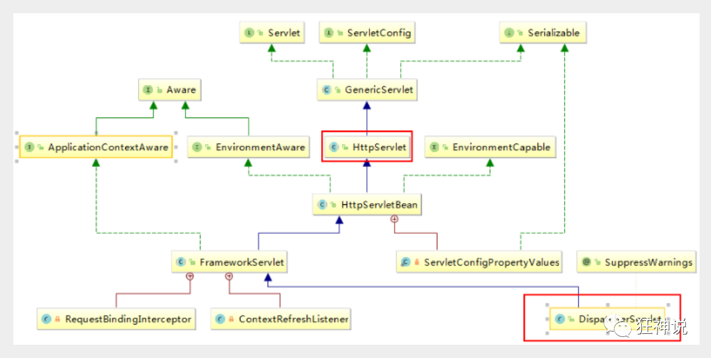

# Springmvc

狂神微信公众号笔记链接：https://mp.weixin.qq.com/mp/homepage?search_click_id=9865794606162307325-1688882830040-5125476268&__biz=Mzg2NTAzMTExNg==&hid=3&sn=456dc4d66f0726730757e319ffdaa23e&scene=18#wechat_redirect

## 1.回顾MVC

- MVC是模型(Model)、视图(View)、控制器(Controller)的简写，是一种软件设计规范。
- 是将业务逻辑、数据、显示分离的方法来组织代码。
- MVC主要作用是**降低了视图与业务逻辑间的双向偶合**。
- MVC不是一种设计模式，**MVC是一种架构模式**。当然不同的MVC存在差异。

**Model（模型）：**数据模型，提供要展示的数据，因此包含数据和行为，可以认为是领域模型或JavaBean组件（包含数据和行为），不过现在一般都分离开来：Value Object（数据Dao） 和 服务层（行为Service）。也就是模型提供了模型数据查询和模型数据的状态更新等功能，包括数据和业务。

**View（视图）：**负责进行模型的展示，一般就是我们见到的用户界面，客户想看到的东西。

**Controller（控制器）：**接收用户请求，委托给模型进行处理（状态改变），处理完毕后把返回的模型数据返回给视图，由视图负责展示。也就是说控制器做了个调度员的工作。

**最典型的MVC就是JSP + servlet + javabean的模式。**

## 2.回顾Servlet

项目搭建发生问题

1. tomcat版本和servlet、jsp、jstl的包版本不匹配导致运行报错

```
   <dependency>
       <groupId>org.apache.tomcat</groupId>
       <artifactId>tomcat-servlet-api</artifactId>
       <version>10.0.12</version>
   </dependency>
   
   <dependency>
       <groupId>org.apache.tomcat</groupId>
       <artifactId>tomcat-jsp-api</artifactId>
       <version>10.0.12</version>
   </dependency>
```

tomcat 10.0对应的包，且类中导入到包不再是javax下的，而是jakarta下。

```
import jakarta.servlet.ServletException;
import jakarta.servlet.http.HttpServlet;
import jakarta.servlet.http.HttpServletRequest;
import jakarta.servlet.http.HttpServletResponse;
```


2. servlet必须在web.xml中配置

```
<servlet>
    <servlet-name>hello</servlet-name>
    <servlet-class>com.rst.servlet.HelloServlet</servlet-class>
</servlet>
<servlet-mapping>
    <servlet-name>hello</servlet-name>
    <url-pattern>/hello</url-pattern>
</servlet-mapping>
```


## 3.什么是SpringMVC

### 1.概述

Spring MVC是Spring Framework的一部分，是基于Java实现MVC的轻量级Web框架。

查看官方文档：https://docs.spring.io/spring/docs/5.2.0.RELEASE/spring-framework-reference/web.html#spring-web

 Spring MVC的特点：

1. 轻量级，简单易学
2. 高效 , 基于请求响应的MVC框架
3. 与Spring兼容性好，无缝结合
4. 约定优于配置
5. 功能强大：RESTful、数据验证、格式化、本地化、主题等
6. 简洁灵活

Spring的web框架围绕**DispatcherServlet** [ 调度Servlet ] 设计。

DispatcherServlet的作用是将请求分发到不同的处理器。从Spring 2.5开始，使用Java 5或者以上版本的用户可以采用基于注解形式进行开发，十分简洁；

正因为SpringMVC好 , 简单 , 便捷 , 易学 , 天生和Spring无缝集成(使用SpringIoC和Aop) , 使用约定优于配置 . 能够进行简单的junit测试 . 支持Restful风格 .异常处理 , 本地化 , 国际化 , 数据验证 , 类型转换 , 拦截器 等等......所以我们要学习 .

**最重要的一点还是用的人多 , 使用的公司多 .** 


### 2.中心控制器

Spring的web框架围绕DispatcherServlet设计。DispatcherServlet的作用是将请求分发到不同的处理器。从Spring 2.5开始，使用Java 5或者以上版本的用户可以采用基于注解的controller声明方式。

​	Spring MVC框架像许多其他MVC框架一样, **以请求为驱动** , **围绕一个中心Servlet分派请求及提供其他功能**，**DispatcherServlet是一个实际的Servlet (它继承自HttpServlet 基类)**。




## 4.SpringMVC执行原理


图为SpringMVC的一个较完整的流程图，实线表示SpringMVC框架提供的技术，不需要开发者实现，虚线表示需要开发者实现。

**简要分析执行流程**

1. DispatcherServlet表示前置控制器，是整个SpringMVC的控制中心。用户发出请求，DispatcherServlet接收请求并拦截请求。

   我们假设请求的url为 : http://localhost:8080/SpringMVC/hello

   

   **如上url拆分成三部分：**

   http://localhost:8080服务器域名

   SpringMVC部署在服务器上的web站点

   hello表示控制器

   通过分析，如上url表示为：请求位于服务器localhost:8080上的SpringMVC站点的hello控制器。

2. HandlerMapping为处理器映射。DispatcherServlet调用HandlerMapping,HandlerMapping根据请求url查找Handler。

3. HandlerExecution表示具体的Handler,其主要作用是根据url查找控制器，如上url被查找控制器为：hello。

4. HandlerExecution将解析后的信息传递给DispatcherServlet,如解析控制器映射等。

5. HandlerAdapter表示处理器适配器，其按照特定的规则去执行Handler。

6. Handler让具体的Controller执行。

7. Controller将具体的执行信息返回给HandlerAdapter,如ModelAndView。

8. HandlerAdapter将视图逻辑名或模型传递给DispatcherServlet。

9. DispatcherServlet调用视图解析器(ViewResolver)来解析HandlerAdapter传递的逻辑视图名。

10. 视图解析器将解析的逻辑视图名传给DispatcherServlet。

11. DispatcherServlet根据视图解析器解析的视图结果，调用具体的视图。

12. 最终视图呈现给用户。


## 5.hello springmvc

**可能遇到的问题：访问出现404，排查步骤：**

1. 查看控制台输出，看一下是不是缺少了什么jar包。
2. **如果jar包存在，显示无法输出，就在IDEA的项目发布中，添加lib依赖！**
3. 重启Tomcat 即可解决！


1. 注册DispatchServlet

   ```
   <?xml version="1.0" encoding="UTF-8"?>
   <web-app xmlns="https://jakarta.ee/xml/ns/jakartaee"
            xmlns:xsi="http://www.w3.org/2001/XMLSchema-instance"
            xsi:schemaLocation="https://jakarta.ee/xml/ns/jakartaee https://jakarta.ee/xml/ns/jakartaee/web-app_5_0.xsd"
            version="5.0">
       <!--1.注册DispatcherServlet-->
       <servlet>
           <servlet-name>springmvc</servlet-name>
           <servlet-class>org.springframework.web.servlet.DispatcherServlet</servlet-class>
           <!--关联一个springmvc的配置文件:【servlet-name】-servlet.xml-->
           <init-param>
               <param-name>contextConfigLocation</param-name>
               <param-value>classpath:springmvc-servlet.xml</param-value>
           </init-param>
           <!--启动级别-1,与服务器同时启动-->
           <load-on-startup>1</load-on-startup>
       </servlet>
   
       <!--/ 匹配所有的请求；（不包括.jsp）-->
       <!--/* 匹配所有的请求；（包括.jsp）-->
       <servlet-mapping>
           <servlet-name>springmvc</servlet-name>
           <url-pattern>/</url-pattern>
       </servlet-mapping>
   </web-app>
   ```

2. 配置spring

   包括：**处理映射器、处理适配器、视图解析器、Controller**

   ```
   <?xml version="1.0" encoding="UTF-8"?>
   <beans xmlns="http://www.springframework.org/schema/beans"
          xmlns:xsi="http://www.w3.org/2001/XMLSchema-instance"
          xsi:schemaLocation="http://www.springframework.org/schema/beans
          http://www.springframework.org/schema/beans/spring-beans.xsd">
   
   
       <bean class="org.springframework.web.servlet.handler.BeanNameUrlHandlerMapping"/>
       <bean class="org.springframework.web.servlet.mvc.SimpleControllerHandlerAdapter"/>
   
   
       <!--视图解析器:DispatcherServlet给他的ModelAndView-->
       <bean class="org.springframework.web.servlet.view.InternalResourceViewResolver" id="InternalResourceViewResolver">
           <!--前缀-->
           <property name="prefix" value="/WEB-INF/jsp/"/>
           <!--后缀-->
           <property name="suffix" value=".jsp"/>
       </bean>
   
   
       <!--Handler-->
       <bean id="/hello" class="com.rst.controller.HelloController"/>
   
   </beans>
   ```

3. 接下来就是去创建对应的控制类 , controller

4. 最后完善前端视图和controller之间的对应

5. 测试运行调试.


## 6.注解版

Spring配置

```
<?xml version="1.0" encoding="UTF-8"?>
<beans xmlns="http://www.springframework.org/schema/beans"
       xmlns:xsi="http://www.w3.org/2001/XMLSchema-instance"
       xmlns:context="http://www.springframework.org/schema/context"
       xmlns:mvc="http://www.springframework.org/schema/mvc"
       xsi:schemaLocation="http://www.springframework.org/schema/beans
       http://www.springframework.org/schema/beans/spring-beans.xsd
       http://www.springframework.org/schema/context
       https://www.springframework.org/schema/context/spring-context.xsd
       http://www.springframework.org/schema/mvc
       https://www.springframework.org/schema/mvc/spring-mvc.xsd">

    <!-- 自动扫描包，让指定包下的注解生效,由IOC容器统一管理 -->
    <context:component-scan base-package="com.rst.controller"/>
    <!-- 让Spring MVC不处理静态资源 -->
    <mvc:default-servlet-handler/>

    <mvc:annotation-driven/>

    <!--视图解析器:DispatcherServlet给他的ModelAndView-->
    <bean class="org.springframework.web.servlet.view.InternalResourceViewResolver" id="InternalResourceViewResolver">
        <!--前缀-->
        <property name="prefix" value="/WEB-INF/jsp/"/>
        <!--后缀-->
        <property name="suffix" value=".jsp"/>
    </bean>


</beans>
```


@Controller

```
package com.rst.controller;

import org.springframework.stereotype.Controller;
import org.springframework.ui.Model;
import org.springframework.web.bind.annotation.RequestMapping;

@Controller
@RequestMapping("/h")
public class HelloController {
    @RequestMapping("/hell")
    public String hello(Model model) {
        model.addAttribute("msg", "hello");
        return "hello";
    }
}
```

@Controller 返回视图解析器

@restController 返回字符串

@ResponseBody 用在方法上，返回字符串

## 7.RestFul风格

**概念**

Restful就是一个资源定位及资源操作的风格。不是标准也不是协议，只是一种风格。基于这个风格设计的软件可以更简洁，更有层次，更易于实现缓存等机制。

**功能**

资源：互联网所有的事物都可以被抽象为资源

资源操作：使用POST、DELETE、PUT、GET，使用不同方法对资源进行操作。

分别对应 添加、 删除、修改、查询。

**传统方式操作资源**  ：通过不同的参数来实现不同的效果！方法单一，post 和 get

​	http://127.0.0.1/item/queryItem.action?id=1 查询,GET

​	http://127.0.0.1/item/saveItem.action 新增,POST

​	http://127.0.0.1/item/updateItem.action 更新,POST

​	http://127.0.0.1/item/deleteItem.action?id=1 删除,GET或POST

**使用RESTful操作资源** ：可以通过不同的请求方式来实现不同的效果！如下：请求地址一样，但是功能可以不同！

​	http://127.0.0.1/item/1 查询,GET

​	http://127.0.0.1/item 新增,POST

​	http://127.0.0.1/item 更新,PUT

​	http://127.0.0.1/item/1 删除,DELETE

**学习测试**

1. 在新建一个类 RestFulController

   ```
   @Controller
   public class RestFulController {
   }
   ```

2. 在Spring MVC中可以使用  @PathVariable 注解，让方法参数的值对应绑定到一个URI模板变量上。

   ```
   @Controller
   public class RestFulController {
   
      //映射访问路径
      @RequestMapping("/commit/{p1}/{p2}")
      public String index(@PathVariable int p1, @PathVariable int p2, Model model){
          
          int result = p1+p2;
          //Spring MVC会自动实例化一个Model对象用于向视图中传值
          model.addAttribute("msg", "结果："+result);
          //返回视图位置
          return "test";
          
     }
      
   }
   ```


**使用method属性指定请求类型**

用于约束请求的类型，可以收窄请求范围。指定请求谓词的类型如GET, POST, HEAD, OPTIONS, PUT, PATCH, DELETE, TRACE等

我们来测试一下：

- 增加一个方法

  ```
  //映射访问路径,必须是POST请求
  @RequestMapping(value = "/hello",method = {RequestMethod.POST})
  public String index2(Model model){
     model.addAttribute("msg", "hello!");
     return "test";
  }
  ```


**所有的地址栏请求默认都会是 HTTP GET 类型的。**

方法级别的注解变体有如下几个：组合注解

```
@GetMapping
@PostMapping
@PutMapping
@DeleteMapping
@PatchMapping
```

@GetMapping 是一个组合注解，平时使用的会比较多！

它所扮演的是 @RequestMapping(method =RequestMethod.GET) 的一个快捷方式。 


## 8.结果跳转

**通过SpringMVC来实现转发和重定向 - 无需视图解析器；**

测试前，需要将视图解析器注释掉

```
@Controller
public class ResultSpringMVC {
   @RequestMapping("/rsm/t1")
   public String test1(){
       //转发
       return "/index.jsp";
  }

   @RequestMapping("/rsm/t2")
   public String test2(){
       //转发二
       return "forward:/index.jsp";
  }

   @RequestMapping("/rsm/t3")
   public String test3(){
       //重定向
       return "redirect:/index.jsp";
  }
}
```


**通过SpringMVC来实现转发和重定向 - 有视图解析器；**

重定向 , 不需要视图解析器 , 本质就是重新请求一个新地方嘛 , 所以注意路径问题.

可以重定向到另外一个请求实现 .

```
@Controller
public class ResultSpringMVC2 {
   @RequestMapping("/rsm2/t1")
   public String test1(){
       //转发
       return "test";
  }

   @RequestMapping("/rsm2/t2")
   public String test2(){
       //重定向
       return "redirect:/index.jsp";
       //return "redirect:hello.do"; //hello.do为另一个请求/
  }

}
```


Tomcat WEB-INF目录下的文件，浏览器一般无法直接方法，只能通过[重定向](https://so.csdn.net/so/search?q=重定向&spm=1001.2101.3001.7020)后才可以访问，如果需要直接访问，可以放在和WEB-INF同级目录下。


## 8.接收参数和回显

```
@Controller
@RequestMapping("/user")
public class Controller2 {
    @GetMapping("/1")
    public String test1(@RequestParam("username") String name, Model m) {
        m.addAttribute("msg", name);
        return "hello";
    }

    @GetMapping("/2")
    public String test2(User user, Model m) {
        m.addAttribute("msg", user);
        return "hello";
    }
}
```


无论前端使用参数名和方法参数名是否一样，尽量都填上@RequestParam，表明参数用作接受返回值。


**form表单传值乱码解决方法**

```
<filter>
    <filter-name>encoding</filter-name>
    <filter-class>org.springframework.web.filter.CharacterEncodingFilter</filter-class>
    <init-param>
        <param-name>encoding</param-name>
        <param-value>utf-8</param-value>
    </init-param>
</filter>
<filter-mapping>
    <filter-name>encoding</filter-name>
    <url-pattern>/*</url-pattern>
</filter-mapping>
```

需要在web里配置过滤器


注：当java层面不纯在乱码问题时，前端仍然乱码，和可能时前端页面编码不匹配，应当确认前端编码是否与后端一致。


## 9.json

前后端分离时代：

后端部署后端，提供接口，提供数据；

json

前端独立部署，负责渲染后端数据；


```
<script type="text/javascript">
    let user = {
        name: "rst",
        age: 22
    };

    console.log(user);

    let s = JSON.stringify(user);
    console.log(s);

    let parse = JSON.parse(s);
    console.log(parse);

</script>
```


//使用 `var` 声明的变量将在任何代码执行前被创建，这被称为变量提升。这些变量的初始值为 `undefined`。

```
"use strict";
console.log(x); // undefined (注意，不会抛出 ReferenceError)
console.log("still going..."); // still going...
var x = 1;
console.log(x); // 1
console.log("still going..."); // still going...
```


## 10.Jackson

1. 导包

   ```
   <!-- https://mvnrepository.com/artifact/com.fasterxml.jackson.core/jackson-databind -->
   <dependency>
       <groupId>com.fasterxml.jackson.core</groupId>
       <artifactId>jackson-databind</artifactId>
       <version>2.14.2</version>
   </dependency>
   ```

2. ObjectMapper

   可直接将对象转化为json字符串

3. 创建一个jackson工具类

   ```
   package com.rst.util;
   
   import com.fasterxml.jackson.core.JsonProcessingException;
   import com.fasterxml.jackson.databind.ObjectMapper;
   import com.fasterxml.jackson.databind.SerializationFeature;
   
   import java.text.SimpleDateFormat;
   
   public class JsonUtil {
       public static String getJson(Object object, String sdf) {
           ObjectMapper objectMapper = new ObjectMapper();
   
           objectMapper.configure(SerializationFeature.WRITE_DATES_AS_TIMESTAMPS, false);
   
           SimpleDateFormat dateFormat = new SimpleDateFormat(sdf);
           objectMapper.setDateFormat(dateFormat);
   
           try {
               return objectMapper.writeValueAsString(object);
           } catch (JsonProcessingException e) {
               e.printStackTrace();
           }
   
           return null;
       }
   
       public static String getJson(Object object) {
           return getJson(object, "yyyy-MM-dd HH-mm-ss");
       }
   }
   ```

可直接调用工具类实现功能，减少代码复写； ObjectMapper对于时间默认按时间戳格式转化为字符串。

## 11.fastjson

```
<dependency>
   <groupId>com.alibaba</groupId>
   <artifactId>fastjson</artifactId>
   <version>1.2.60</version>
</dependency>
```


```
JSON.toJSONString() //Java对象 转 JSON字符串
JSON.parseObject(str2,User.class) //JSON字符串 转 Java对象
JSONObject jsonObject1 = (JSONObject) JSON.toJSON(user2); //Java对象 转 JSON对象
User to_java_user = JSON.toJavaObject(jsonObject1, User.class); //JSON对象 转 Java对象
 
```


## 12.整合ssm

[狂神说SpringMVC05：整合SSM框架 (qq.com)](https://mp.weixin.qq.com/s?__biz=Mzg2NTAzMTExNg==&mid=2247484004&idx=1&sn=cef9d881d0a8d7db7e8ddc6a380a9a76&scene=19#wechat_redirect)


## 13.AJax(jQurey)

```
<%@ page contentType="text/html;charset=UTF-8" language="java" %>
<html>
<head>
    <title>$Title$</title>
    <script src="${pageContext.request.contextPath}/statics/js/code.jquery.com_jquery-3.7.1.js"></script>
    <script>
        function a1() {
            $.post({
                url: "${pageContext.request.contextPath}/a1",
                data: {"name": $("#name").val()},
                success: function (data) {
                    alert(data);
                }
            })

        }
    </script>
</head>
<body>
<input type="text" onblur="a1()" id="name">
</body>
```

```
@RequestMapping("/a1")
public void a1(String name, HttpServletResponse response) throws IOException {
    System.out.println(name);
    response.getWriter().print("true");
}
```


问题：

1. 配好spring静态资源过滤
2. jqurey.js放在web目录下
3. controller方法为void
