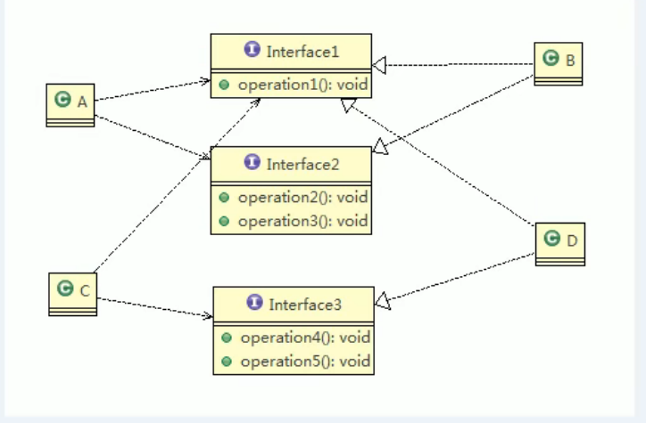
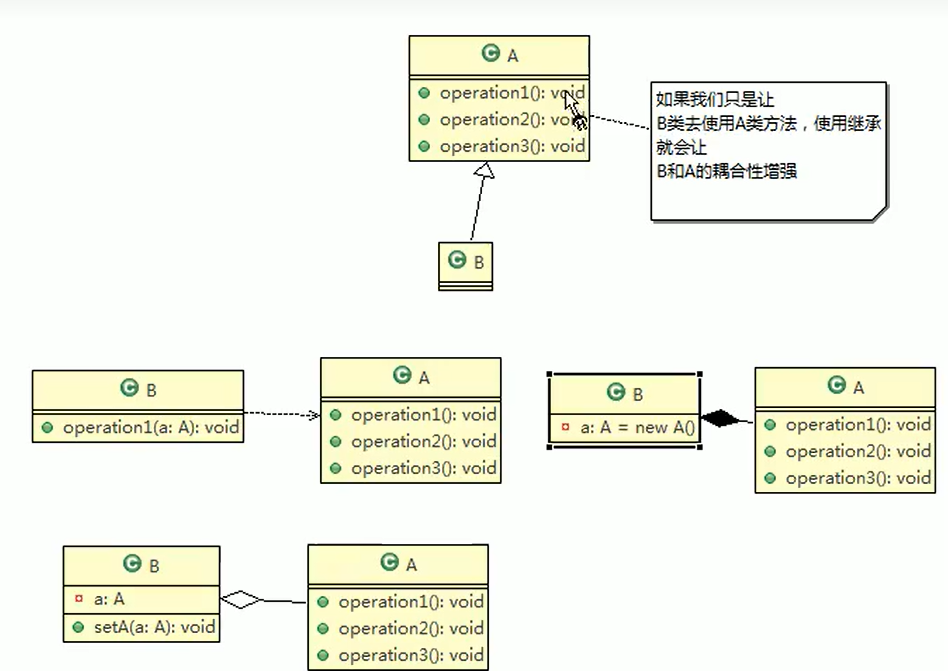

# 图解设计模式+源码分析

## 1.设计模式内容介绍

1. 能画出设计模式的uml图
2. 了解设计模式的特点和多种用法
3. 能分析出源码中使用了什么模式


**设计模式常用的七大原则**

- 单一职责
- 接口隔离
- 依赖倒转
- 里氏替换
- 开闭原则 ocp
- 迪米特法则
- 合成复用原则


## 2.设计模式原则介绍

### 1.单一职责

> 1. 降低代码复杂度
> 2. 提高可读性，维护性
> 3. 减低变更引起的风险
> 4. 类级别、方法级别，可以更具代码复杂度选择合适的方式


### 2.接口隔离原则（interface Segragation principle）

一个类对应另一个类的接口依赖应该建立在最小接口上。即将多功能接口拆分，每个接口对应相应的类。




### 3.依赖倒转（independence inversion principle）

1. 高层模块不该依赖低层模块，两者都应该依赖抽象
2. 抽象不应该依赖细节，细节应该**依赖抽象**
3. 依赖倒转的核心思想是面向接口编程
4. 设计理念：相对于多变的细节，抽象的东西要稳定的多，以抽象为基础搭建的架构比以细节为基础的架构要稳定得多。Java中，抽象指的是接口或抽象类，细节指具体的实现类。
5. 使用接口和抽象类的目的是制定好规范，而不涉及任何具体操作，把展现细节的任务交给实现类去完成。


依赖传递的三种方式：接口传递、构造法传递、setter方法传递。


### 4.里氏替换原则

子类对已继承方法的修改会破环整个继承体系，同时继承降低了程序的可移植性，增加了对象的耦合性。

>1. 所有引用基类的地方必须透明的使用其子类的对象
>2. 子类尽量不要重写父类方法
>3. 适当情况下，可以通过聚合、组合、依赖来解决

做法：原来父类和子类都继承一个更加通俗的基类，原有的继承关系去掉，采用依赖、聚合、组合等关系替换。


### 5.开闭原则

当软件需求变化时，尽量通过（提供方）扩展实体行为来实现变化，而不是（使用方）修改已有的代码。这就要求程序设计时需要面向抽象，将框架抽象才能方便以后的扩展和维护。


### 6.迪米特法则

* 最少知道原则，一个类对自己依赖的类知道的越少越好。对于依赖的类，不管逻辑多么复杂都应该将其封装在类的内部，对外提供public方法，不对泄露信息。
* 类与类关系越密切，耦合度越大。
* 更简单定义：只与直接朋友通讯
* 直接朋友：只要对象之间有耦合关系，就可以称为朋友关系；当类出现在成员变量、方法参数、返回值时我们称其为直接朋友，局部变量中的类不是直接朋友。**陌生类最好不要以局部变量的形式出现在类的内部。**


### 7.合成复用原则（composite reuse principle）

尽量使用合成、聚合的方式，而不是继承。




## 3.23种设计模式

### 1.设计模式分类

1. 创建型模式：**单例模式**、抽象工厂模式、原型模式、建造者模式、**工厂模式**
2. 结构型模式：**适配器模式**、桥接模式、**装饰者模式**、组合模式、外观模式、享元模式、**代理模式**
3. 行为模式：模板方法模式、命令模式、访问者模式、迭代器模式、**观察者模式**、中介者模式、备忘录模式、解释器模式、状态模式、策略模式、**责任链模式**


### 2.单例模式

就是采取一定的方法在整个的软件系统中，对某个类只能存在一个对象实例。

#### 1.饿汉式

* **静态常量**

1. 构造器私有化

2. 类内部创建对象

3. 向外暴露一个静态的公共方法。

```
class Singleton{
//私有化构造器
	private Singleton(){
	}
//创建内部类
	private final static Singleton instance = new Singleton();
//静态的公共方法
	public static Singleton getSingleton(){
		return instance;
	}
	
}
```

> * 该方法在类装载的时候就完成了实例化，避免了线程同步问题。但没有达到lazy loading效果，如果这个实例至始至终没用过，就会造成内存浪费。
> * 导致类装载的原因很多，所以不能保证一定用上该实例。


* **静态代码块**

```
class Singleton{
//私有化构造器
	private Singleton(){
	}
//静态成员变量
	private static Singleton instance;
//静态代码块
	static{
		instance = new Singleton();
	}
//静态的公共方法
	public static Singleton getSingleton(){
		return instance;
	}
	
}
```

> * 与静态常量类似，有同样优缺点。


#### 2.懒汉式

* **线程不安全**

```
class Singleton{
//私有化构造器
	private Singleton(){
	}
	private static Singleton instance;

//静态的公共方法
	public static Singleton getSingleton(){
		if(instance == null){
			instance = new Singleton();
		}
		return instance;
	}
	
}
```

> * 起到了lazy loading的效果，但只能用于单线程下
> * 多线程下可能导致多个线程同时通过if判断，并产生多个实例对象


* **线程安全**

```
class Singleton{
//私有化构造器
	private Singleton(){
	}
	private static Singleton instance;

//静态的公共方法，加入同步限制解决线程不安全问题synchronized
	public static synchronized Singleton getSingleton(){
		if(instance == null){
			instance = new Singleton();
		}
		return instance;
	}
	
}
```

> * 解决了线程安全，但效率太低了
> * 每个线程获取实例时都需要进行线程同步


#### 3.双重检查（doublecheck）

[Java volatile关键字最全总结：原理剖析与实例讲解(简单易懂)](https://blog.csdn.net/u012723673/article/details/80682208)

```
class Singleton{
//私有化构造器
	private Singleton(){
	}
	private static volatile Singleton instance;

//静态的公共方法，加入同步限制解决线程不安全问题synchronized
	public static Singleton getSingleton(){
		if(instance == null){
            synchronized(Singleton.class){
                if(instance == null){
                    instance = new Singleton();
                }
            }
        }
		return instance;
	}
}
```

> * volatile能强制将对缓存的修改写入主存（可见性），同时解决重排序问题（有序性）
> * 懒加载、线程安全、效率高（推荐方式）


#### 4.静态类内部类

```
class Singleton{
//私有化构造器
	private Singleton(){}
	
//静态内部类
	private static class SingletonInstance{
		private final static Singleton instance = new Singleton();
	}

//静态的公共方法
	public static Singleton getSingleton(){
		return SingletonInstance.instance;
	}
}
```

> * 懒加载、线程安全（推荐）
> * 当调用getSingleton方法时，SingletonInstance内部类才会被加载


#### 5.枚举

```
enum Singleton{
	INSTANCE;
	public void method(){}
}
```

> 线程安全、防止反序列化重新创建对象（推荐）


#### 6.jdk单例模式分析

Runtime：采用了静态常量的饿汉式单例模式。


#### 7.单例模式注意事项

1. 想实例化一个单例类时，要使用相应的方法获取对象，而不是new。
2. 使用场景：需要频繁的进行创建销毁的对象、创建对象耗时多或耗费资源多，但经常用的对象、工具类对象、频繁访问数据库或文件的对象（session工厂）。


### 3.工厂模式

#### 1.简单工厂模式

* 工厂模式都需要解决ocp原则的问题，如提高代码的扩展性，减少新对象增加时对代码的改动。

* 简单工厂模式**将创建对象的行为封装到一个类**中，当有新的对象时只需要修改该对象即可，这个对象就是工厂类。 


#### 2.工厂方法模式


ORderPizza（抽象类）在这充当工厂类，BJOrderPizza、LDOrderPizza为其子类，对抽象方法进行具体实现。

#### 3.抽象工厂模式


* 抽象工厂模式将工厂分为两层抽象接口、具体实现类，程序员可根据需求使用对应的子类。
* 这样的设计模式形成了一个工厂簇，更利于扩展和维护。


#### 4.简单工厂模式 jdk源码分析

Calendar类中就使用了简单工厂模式

```
Calendar cal = Calendar.getInstance();
```

`getInstance()`静态方法会去调用`createCalendar`方法，该方法就是一个简单工厂模式，create方法根据传入参数返回实例对象。


### 4.原型模式

#### 1.克隆羊问题

* 如何创建多个属性一模一样的对象，传统方式是多次new对象，但这样的方式效率低下，不够灵活。

思路：`Object`类有一个`clone()`该方法可以将一个java对象复制一份，但该java类需要实现接口`Cloneable`   =>  原型模式


#### 2.原型模式在spring框架中的使用

```
<bean id="" class="" scope="prototype"/>
```

原型模式的bean，该bean创建多个对象不是同一个。其中getbean过程是一个工厂模式，当判断scope为prototype时则会用原型模式的方法创建一个对象并返回。


#### 3.深拷贝

思考：当被克隆对象用属性是一个对象时，克隆后的对象中属性对象会发生变化吗？

上面的克隆方法不会改变对象属性指向的对象，所有的克隆对象中对象属性都是同一个。

**浅拷贝**：基本数据类型采用**值传递**，数值、对象等采用**引用传递**，所以浅拷贝下对象属性指向的对象不会发生变化。


两种深拷贝实现方式：

* **重写clone方法**

```
public class DeepPrototype implements Serializable,Cloneable{
	public String name;
	public DeepCloneTarget target;
	
	public DeepPrototype (){
		super();
	}
	
	protected Object clone() throws CloneNotSupportedException{
		DeepPrototype deepPrototype =(DeepPrototype)super.clone;
		//对象属性单独处理
		deepPrototype.target = (DeepCloneTarget)target.clone();
		
		return deepPrototype;
	}
	
}
```


* **对象序列化(推荐使用)**

```
//需要使用的流对象
ByteArrayOutputStream bos = null;
ObjectOutputStream oos = null;
ByteArrayInputStream bis = null;
ObjectInputStream ois = null;


try{
    //序列化
    bos = new ByteArrayOutputStream();
    oos = new ObjectOutputStream(bos);
    oos.writeObject(this);

    //反序列化
    bis = new ByteArrayInputStream(bos.toByteArray());
    ois = new ObjectInputStream(bis);
    DeepPrototype deepPrototype = (DeepPrototype)ois.readObject();
    
    return deepPrototype;
    }catch(Exception e){
    	e.printStackTrace();
    	return null;
    }finally{
    	//关闭流
    	try{
    		bos.close;
    		oos.close;
    		bis.close;
    		ois.close;
    	}catch(Exception e){
    	
    	}
    }
    
```


### 5.建造者模式


* 上述设计结构过于简单，没有缓存对象，程序的扩展性维护性不好；房子和其建造过程被封装在一个类中，耦合性增强。

* 无论盖什么房子，它们都有共同的修建步骤，所以可以使用建造者模式来设计房子类的生成。


#### 1.概念

> 1、**定义**：将一个复杂对象的构建与它的表示分离，使得同样的构建过程可以创建不同的表示
> 2、**主要作用**：在用户不知道对象的**建造过程和细节**的情况下就可以直接创建复杂的对象。
> 3、**如何使用**：用户只需要给出指定复杂对象的类型和内容，建造者模式负责按顺序创建复杂对象（把内部的建造过程和细节隐藏起来）
> 4、**解决的问题**：
> （1）、方便用户创建复杂的对象（不需要知道实现过程）
> （2）、代码复用性 & 封装性（将对象构建过程和细节进行封装 & 复用）
> 5、**注意事项**：与工厂模式的区别是：建造者模式更加关注与零件装配的顺序，一般用来创建更为复杂的对象


#### 2.建造者模式的四个角色

1. **Product**：具体的产品对象
2. **Builder**（抽象建造者）：创建Product对象各个指定部件的**接口/抽象类**
3. **ConcreteBuilder**：实现接口，构建和装配部件
4. **Director**：使用建造者创建复杂的对象。隔离了客户与对象的生产过程；负责控制产品对象的生产过程。


Director**聚合**了Builder用其类创建产品对象；Builder**组合**了Product，复用产品方法对其部件进行赋值。

 

#### 3.jdk源码分析

`StringBuilder`

* `Appendable`接口定义了多个`append`方法，其为抽象建造者。
* `AbstractStringBuilder`实现接口`Appendale`的方法，其已经是建造者。
* `Stringbuilder`继承了`AbstractStringBuilder`,`Stringbuilder`既是具体建造者，也是指挥者。


#### 4.建造者模式总结

1. 如果产品之间差异性很大，则不适合使用建造者模式
2. 工厂模式关系的是一个产品家族的创建，不关系产品具体生产过程；建造者模式关心产品是如何由各个组件生产而成。

 

### 6.适配器模式

#### 1.介绍

> 1. 将某个原有的类接口转化成客户端期望的另一个接口表示，实现兼容效果，让原本接口不匹配的类能够协同工作
> 2. 结构性模式
> 3. 类适配器、对象适配器、接口适配器


#### 2.类适配器

适配器需要**继承被适配类**和**实现目标接口**


上图中，通过适配器VoltagAdapter将220v转化为5v用于手机充电。


> 1. 类适配器需要继承src，导致dst必须是接口，有局限性
> 2. 继承的方法会让src的方法暴露出来，增加使用成本
> 3. 继承时可以重写src的方法，提高了适配器的灵活性


#### 3.对象适配器

适配器不在继承src，而是**持有src**，从合成复用的角度用关联关系替代继承关系。


> 1. 解决了继承的局限性
> 2. 使用成本更低，更灵活


#### 4.接口适配器

当不需要实现接口提供的全部方法时，可以设计一个抽象类，并为该接口中的每个方法提供默认实现空方法，当使用时只需选择性覆盖所要用的方法。


```
//匿名内部类
new AbsAdapter(){
	@Override
	public operation1(){
		//具体实现
	}
}
```

适合不想实现接口所有方法的情况下。


#### 5.适配器在SpringMvc中的使用

* `handlerAdapter`，对于不同`handlerMapping`也就是`Controller`，spring需要用不同的`handlerAdapter`去解析。

* 实现`handlerAdapter`的类：`SimpleControllerHandlerAdapter`、`HttpRequestHandlerAdapter`等


`handlerAdapter`、`Controller`、`DispatchServlet`三者之间的关系


### 7.桥接模式（结构型）

解决**扩展性**类爆炸问题，从结构上降低代码维护量。


#### 1.介绍

> 1. 将实现与抽象放在两个不同的类层次中，使两个层次可以独立改变
> 2. 结构型设计模式
> 3. 该模式基于**最小设计原则**，通过封装、聚合、继承等行为让不同类承担不同的职责，**主要就是将抽象与行为实现分离开来，从而保持各个部分的独立性和扩展性**


#### 2.实现uml分析


uml类图说明：

1. Cilent是抽象类的调用者
2. Abstraction是抽象类，RefinedAbstraction是抽象类的子类。
3. Implementor是行为实现接口，ConcreteImplementorA、B是具体的行为实现类。
4. Abstraction和Implementor是聚合关系，通过聚合的方式将抽象和行为实现分离开，Abstraction抽象类在这充当桥接类。


#### 3.JDBC源码分析


`DriverManager`充当桥接类，`Connection`为行为接口，`Connection`的子类可以实现mysql、orcle等的连接行为。


* `DriverManager`和`Connection`的uml结构图


可以看出其和交接模式的结构图很相似，图左边是行为接口，DriverManager通过关联方式桥接Connection的子类。


#### 4.总结

> 1. 桥接模式有助于系统分层，提高系统灵活性，产生更好的结构化系统
> 2. 对高层业务，只需要知道**抽象部分和实现接口**就可以了。
> 3. 桥接模式要求程序员能正确识别系统中两个对立变化的维度，分出抽象层和实现层，这对应用场景有一定局限性。


使用场景：1)多继承导致系统类个数急剧增加 2)jdbc驱动、银行转账、消息管理等


### 8.装饰者模式

场景：星巴克咖啡类爆炸问题

#### 1.介绍

装饰者模式可以**动态的**将功能附加到对象上，在对象扩展上比继承更灵活，同时也更符合ocp原则。


模式中的对象：

* 主体（ConcreteComponent），比如具体饮品
* 包装（Decorator），糖、冰等


Decorator装饰者聚合了主体，通过这种方式来修饰主体。


#### 2.装饰者模式解决星巴克咖啡问题

* 设计结构


* 订单实现


#### 3.JDK源码分析


 FilterInputStream，即装饰类，它的子类可以用来装饰其它类型的 InputStream。

> 比如现在我想读取C盘下的test.txt文件，我们会这样用：

```
FileInputStream f = new FileInputStream(new File(“c:/test.txt”));
```

> 现在我嫌读取的太慢了，想给它加个缓冲的功能，怎么办呢？只需要给它套上一层外壳即可。

```
BufferedInputStream f = new BufferedInputStream(new FileInputStream(new File(“c:/test.txt”)));
```

> 这里，BufferedInputStream 就相当于外壳。当然，你也可以同时用多个装饰器，每个装饰器都有特定的功能。就好比我想吃蛋糕，但你可以给蛋糕同时加上草莓、芒果、樱桃作为点缀。


### 9.组合模式

#### 1.介绍

>* 部分整体模式，建立了对象组的树形结构
>* 组合模式依据树形结构组合对象，以此来表示部分与整体的层次
>* **结构型模式**
>* 组合模式让用户**对单个对象和组合对象的访问具有一致性**


* 模式uml图


> 说明：
>
> 1. Component:是组合对象声明接口，在适当情况下，实现所有子类默认的接口行为，用于访问和管理Component子部件，**Component可以是抽象类或接口**。
> 2. leaf：表示子部件中的叶子节点，叶子节点没有子类。
> 3. Composite：非叶子节点，用于**存储子部件**，**实现接口**，比如增删子部件。


#### 2.组合模式解决院系展示

校>院>系,通过树形结构来实现对象之间的管理关系。


由上图可知，校院系被抽象为一个组织，Organization可以是**抽象类、接口、类**，院通过`Organization`被聚合进校，系通过`Organization`被聚合进院。


* **OrganizationConponent**

```
public abstract class OrganizationConponent{
	private String name;
	private String des;  //说明
	
	public OrganizationConponent(String name,String des){
		super();
		this.name = name;
		this.des = des;
	}
	
	public void add(OrganizationConponent oc){
		//实现默认方法
	}
	
	public void remove(OrganizationConponent oc){
		//实现默认方法
	}
	
	protected abstract void print()；
	
	//get、set方法
}
```


* **University**

```
public class University extend OrganizationConponent{
	//院的集合
	List<OrganizationConponent> list = new ArrayList<OrganizationConponent>();
	
    public University(String name,String des){
		super(name，des);
	}
	
	public void add(OrganizationConponent oc){
		list.add(oc);
	}
	
	public void remove(OrganizationConponent oc){
		list.remove(oc);
	}
	
	protected  void print(){
		System.out.prinln(getName);
		//遍历打印list
	}
}
```


* **Department**

```
public class Department extend OrganizationConponent{

    public Department(String name,String des){
		super(name，des);
	}
	
//Department作为叶子节点不再需要重写管理子节点的接口方法
	
	protected  void print(){
		System.out.prinln(getName);
	}
	
}
```


#### 3.jdk源码分析


> HashMap使用组合模式的uml图


#### 4.总结

> 1. 组合模式可以简化客户端操作,用户**只用操作一种对象**,不需要考虑整体部分或叶子节点
> 2. **较强扩展性**,当组合变化时,只需要调整内部层次关系,客户端不用做出改变.
> 3. 方便构建复杂的组织,**增删节点和遍历**更加简单.
> 4. 要求对象**抽象度高**,当节点和叶子节点差异较大,方法与属性大不相同,则不适用该模式.


### 10.外观模式(过程模式)

**场景:**操作多个设备时,Client端操作流程冗长.

> 例如打开电脑,打开无线鼠标,打开无线键盘,打开无线耳机;当你结束使用时又得关闭电脑.....Client端去一个一个调用设备的流程是冗长的.

**解决方法:**定义一个高层接口,对所有子系统提供一个一致的界面,调用端只跟这接口发生关系,而无需关心子系统的内部细节.


#### 1.介绍

> * 外观模式为子系统中的一组接口提供了一致的界面,定义的高层接口能更方便子系统使用.
> * 高层接口屏蔽了内部子系统的细节,调用时无需关心子系统细节.
> * **结构型**


**原理说明:**

1. 外观类:为调用端提供统一的接口,它知道子系统的细节,能够调用子系统的方法解决调用端请求.
2. 子系统:模块或子系统,是功能的实际提供者.


#### 2.解决影院管理


**设计类图:**


各种设备由`HomeTheaterFacade`统一调用,Client端只需要调用该接口即可.


#### 3.MyBatis下应用源码分析

`Configuration`


图中的`DefaultObjectFactory`、`DefaultObjectWrapperFactory`、`DefaultReflectorFactory`都是**子系统**,Configuration是**高层接口**,`newMetaObject()`方法会同时调用3个子系统方法并返回值.


#### 4.总结

> 1. 外观模式屏蔽了子系统的细节,降低了客户端**使用子系统复杂度**.
> 2. 让子系统与客户端**解耦**,更便于系统维护.
> 3. 更好划分访问层次.
> 4. 在维护一个大型遗留项目时,可能这个系统已经变得难以维护和扩展,此时为系统开发一个Facade类,为遗留系统提供一个清晰的接口,让系统与Facade接口交互,提高复用性.
> 5. 使用外观模式要以**系统有层次,利于维护为目的**.


### 11.享元模式

场景：网站展示项目，不同用户需要不同的展示方式。传统方式会分出多个虚拟空间进行处理，相当于一个网站有多个实例对象，这会造成服务器的资源浪费。

解决思路：**共享数据和部分代码**，将所有网站整合到一个中。


#### 1.介绍

> 1. 蝇量模式，运用共享技术支持大量细粒度的对象
> 2. 常用于系统底层开发，**解决系统性能问题**，像数据库连接池，里面都是创建好的对象，当我们需要时就直接拿来用，避免重新创建。
> 3. 该模式能解决**重复创建对象的内存浪费问题**，当系统中有大量相识对象时，不需要总是创建对象，可以从缓冲池中拿，降低系统内存消耗，提高效率。
> 4. 享元模式被广泛应用于**池技术**，String常量池、数据库连接池、缓冲池等都是享元模式的应用。


* **享元模式原理图**


1）`Flyweight`是抽象的享元角色，它定义出了对象的**内部状态和外部状态**的接口和实现。

2）`ConcreteFlyweight`，是具体的享元角色，实现了抽象类的相关业务。

3）`UnsharedConcreteFlyweight`也是具体的享元角色，但它是不可共享的，不会出现在池中（`FlyweightFactory`）。

4）`FlyweightFactory`享元工厂，相当于一个**池容器**（享元对象集合），提供了获取享元对象的方法


* **内部状态和外部状态定义**


简单来说就是区分这些对象那些是**属性是相同的**，那些是**属性唯一的。**


#### 2.解决网站展示项目


* **WebSite**

```
public abstract class WebSite{
	public abstract void use(User user);
}
```


* **ConcreteWebSite**

```
public class ConcreteWebSite extend WebSite{
	private String type;
	
	public ConcreteWebSite(String type){
		this.type = type;
	}
	
	@Oerride
	public void use(User user){
		System.out.prinln(user.name+"以"+type+”形式浏览“);
	}
}
```


* **WebSiteFactory**

```
public class WebSiteFactory{
	private HashMap<String,WebSite> pool = new HashMap<>();
	
	public WebSite getWebSite(String type){
		if(!pool.containsKey(type)){
			pool.put(type,new ConcreteWebSite(type));
		}
		return (WebSite)pool.get(type);
	}
	
	public int getWebSiteCount(){
		return pool.size();
	}
}
```

注：type是内部状态，user使用者是外部状态


#### 3.jdk源码分析

* `Integer`源码


* `new Integer`和`Integer.valueof()`


#### 4.总结

> 1. 系统中有大量对象，且这些对象消耗大量内存，并且对象的状态大部分可以外部化时，我们可以考虑使用享元模式。
> 2. 用**唯一标识码**判断，如果内存中有就直接用，当没有时在创建，用**HashMap/HashTable**存储。
> 3. 享元模式大大降低了内存消耗，提高了系统效率
> 4. 当使用享元模式时，我们需要分清楚**外部状态和内部状态**，并其设计一个工厂来管理这些享元对象。


### 12.代理模式

#### 1.介绍

> 1. 结构型
> 2. 为对象提供一个替身，以控制这个对象的访问。通过代理模式访问对象，可以减少程序的耦合性，同时当需要实现一些对象扩展操作时能够保证原对象的完整性，即不会影响被代理对象。
> 3. 被代理对象可以是：远程对象、创建开销大的对象、需要安全控制的对象。
> 4. 主要三种代理方式：静态代理、动态代理（jdk代理、接口代理）、Cglib代理（内存中动态的创建对象）


#### 2.静态代理

静态代理需要定义**接口或父类**，代理类和被代理类一起实现相同接口或继承相同父类。


* `TeacherDaoProxy`**代理对象**

```
public class TeacherDaoProxy implement ITeacherDao{
	ITeacherDao target;//目标对象，通过接口聚合

	public TeacherDaoProxy(ITeacherDao target){
		this.target = target;
	}
	
	@Override
	public void teach(){
		System.out.prinln("开始代理");
		target.teach();
		System.out.prinln("结束代理");
	}
}
```

 

优缺点：

> 1. 能在不修改目标对象功能的前提下，通过代理对象实现业务扩展
> 2. 当接口改变时，代理对象、目标对象都需要维护


#### 3.动态代理

> 1. 代理对象不需要实现接口，目标对象仍然需要实现接口。
> 2. 代理对象生成是利用JDK的API，动态的在内存中构建对象。
> 3. 动态生成过程利用了JVM的**反射机制**

* JDK代理对象API

> 1. 类所在包java.lang.reflect.Proxy
> 2. 实现代理所需用的方法`newProxyInstance`方法，方法需要接收三个参数。
>
> `static Object newProxyInstance(ClassLoader loader,Class<?>[] interfaces,InvocationHandler h)`


* **ProxyFactory**

```
public class ProxyFactory{
	Object target; //目标接口
	public ProxyFactory(Object target){
		this.target = target;
	}
	
	//说明
	/**
		1.ClassLoader loader:指定当前目标对象的类加载器，获取加载器的方法固定。
		2.Class<?>[] interfaces：目标对象实现的接口类型，使用泛型方法确实类型。
		3.调用处理，执行目标方法时会触发的事件处理器，把当前执行目标对象作为参数。
		4.method表示被调用目标类的方法，args表示传入方法的参数（可以为空）。
	**/
	
	public Object getProxyInstance(){
		return Proxy.newProxyInstance(target.getClass().getClassLoader,target.getClass().getInterfaces(),new InvocationHandler(){
			@Override
			public Object invoke(Object proxy,Method method,Object[] args){
				System.out.println("开始代理");
				Object result = methoSystem.out.println("开始代理");d.invoke(target,args);
				System.out.println("结束代理");
				return result;
			}
		});
	}
}
```


#### 4.Cglib代理


**类图结构展示**


* `ProxyFactory`

```
public class ProxyFactory implement MethodInterceptor{
	Object target;
	
	public ProxyFactory(Object target{
		this.target = target;
	}

	public getProxyInstance(){
		//创建Enhancer对象，类似于JDK动态代理的Proxy类，下一步就是设置几个参数
        Enhancer enhancer = new Enhancer();
        //设置目标类的字节码文件
        enhancer.setSuperclass(target.class);
        //设置回调函数,这里必须是实现MethodInterceptor接口的类
        enhancer.setCallback(this);
        
        //创建子类代理对象
        return enhancer.create();
	}


//重写intercept以调用目标方法
	@Override
    public Object intercept(Object obj, Method method, Object[] args, MethodProxy proxy) throws Throwable {
        System.out.println("这里是对目标类进行增强！！！");
        //注意这里的方法调用，不是用反射哦！！！
        Object result = method.invoke(target,args);
        return result;
    }  
}
```


**Cglib总结：**Cglib动态代理采用继承的方式来重写父类方法，其中用到了FastClass机制来调用目标对象方法(相当于索引)，这种方法比反射机制更快。

**FastClass机制原理图：**


#### 5.几种代理变体

> 1. 防火墙代理
> 2. 缓存代理
> 3. 远程代理


### 13.模板方法模式

#### 1.介绍

> 1. 行为型模式
> 2. 在一个抽象类公开定义了执行它的方法的模板。它的子类可以按需重写方法实现，但**调用将以抽象类中的方式进行**。


* **类图**


**说明：**

* `AbstractClass`是抽象类，定义了类中方法实现的模板，即算法骨架，`operation1、2、3`则由具体的子类去实现。
* `ConcreteClass`具体子类，需要实现抽象父类中`operation1、2、3`方法。


#### 2.模板方法模式应用


* **SoyaMilk**

```
public abstract Class SoyaMilk{
	//模板方法可以做成final，不让子类去覆盖。
	final void make(){
		select();
		add();
		soak();
		beat();
	}
	
	void select(){
		System.out.prinln("选料");
	}
	
	abstract void add();
	
	void soak(){
		System.out.prinln("浸泡");
	}
	
	void beat(){
		System.out.prinln("打碎");
	}
}
```


#### 3.钩子方法

在父类中定义一个方法，这个方法不用做任何事，子类可以视情况决定要不要覆盖它。

* 添加钩子方法改进`SoyaMilk`抽象类

```
public abstract Class SoyaMilk{
	//模板方法可以做成final，不让子类去覆盖。
	final void make(){
		select();
		if(addif()){
			add();
		}
		soak();
		beat();
	}
	
	void select(){
		System.out.prinln("选料");
	}
	
	abstract void add();
	
	void soak(){
		System.out.prinln("浸泡");
	}
	
	void beat(){
		System.out.prinln("打碎");
	}
	
	//钩子方法,决定是否添加配料
	Boolean addif(){
		return true;
	}
}
```


#### 4.Spring源码分析

spring中**IOC容器初始化**时用到了模板方法模式。


#### 5.总结

> 1. **算法只存在一个地方**，也就是父类中，需要修改算法时只需要修改父类，其子类会继承这些修改。
> 2. 实现了代码的复用，**统一算法**的同时，将具体步骤交个子类实现，提高了程序的灵活性。
> 3. 一般模板方法上都加上**final**以防止子类覆盖。
> 4. 使用场景：对象执行一系列步骤，这些步骤基本相同，但有个别步骤实现时有差异。


### 14.命令模式

#### 1.介绍

> 1. 行为模式。
> 2. 软件设计中，我们通常需要向对象发送请求，但往往我们不知道接受请求者和请求方法是什么，所以此时可以使用命令模式来设计。
> 3. 将**“动作请求者”**从**“动作执行者“**对象中解耦出来。
> 4. 命令模式通常将命令**封装**为一个对象，以便传入不同参数表示不同命令，同时要实现命令撤销功能。


**类图说明：**

1. Invoker是调用者，负责调用命令
2. Command是命令角色，定义了一个命令接口
3. Receiver是执行者，是命令的接收者和执行者
4. ConcreteCommand是抽象命令接口的实现者，负责聚合接收者并调用他们执行execute方法


#### 2.遥控器场景应用


* **LightOnCommand**

```
public class LightOnCommand extend Command{
	LightReceiver rec;
	public LightOnCommand(LightReceiver rec){
		this.rec = rec
	}
	
	@Override
	public void execute(){
		rec.on();
	}
	
	@Override
	public void undo(){
		rec.off();
	}
}
```

* **RemoteController**

```
public class RemoteController{
	Command[] onCommand;
	Command[] offCommand;
	
	Command undo;//记录撤销
	
	public RemoteController(){
		onCommand = new Command[5];
		offCommand = new Command[5];
		for(int i=0;i<5;i++){
			onCommand[i] = new NoCommand();
			offCommand[i] = new NoCommand();
		}
	}
	
	public void on(int n){
		onCommand[n].execute();
		undo = onCommand[n];
	}
	
	public void off(int n){
		offCommand[n].execute();
		undo = offCommand[n];
	}
	
	//执行撤销
	public void undo(){
		undo.undo();
	}
	
	//设置命令
	public void setCommand(int n,Command on,Command off){
		onCommand[n] = on;
		offCommand[n] = off;
	}
	
}
```


#### 3.Spring源码分析


#### 4.总结


### 15.访问者模式

#### 1.介绍


#### 2.实现歌手评分功能


* **Action**

```
public abstract Action(){
	abstract void getManResult(Man man);
	
	abstract void getWomanResult(Woman woman);
}
```

* **Success**

```
public Success extend Action{
	@Override
	public void getManResult(Man man){
		System.out.println("同意");
	}
	@Override
	public void getWomanResult(Woman woman){
		System.out.println("同意");
	}
}
```

* **Person**

```
public abstract Person{
	abstract void accept(Action action);
}
```

* **Man**

```
public Woman extend Person{
	@Override
	void accept(Action action){
		action.getWomanResult(this);
	}
}
```


#### 3.总结


### 16.迭代器模式

#### 1.介绍


**对象说明：**

> 1. Iterator迭代器接口，ConcreteIterator具体迭代器。
> 2. Aggregate一个聚合接口，将与客户端与具体聚合类解耦。
> 3. ConcreteAggregate会聚合一个数据聚合，并调用对应迭代器实现遍历。
> 4. cilent客户端通过Iterator和Aggregate依赖其子类。


#### 2.解决同一遍历问题


* **ComputerCollegeIterator**

```
public class ComputerCollegeIterator extend Iterator{
	Department[] dep;
	int position = 0;
	
	public ComputerCollegeIterator(Department[] dep){
		this.dep = dep;
	}

	@Override
	public boolean hasNext(){
		if(position >= dep.length||dep[position] == null){
			return false;
		}else{
			return true;
		}
	}
	
	@Override
	public Object next(){
		Department department = dep[position];
		position +=1;
		return department;
	}
	
	//remove暂时用不上，直接空实现
	public void remove(){
	
	}
	
}
```

* **College**

```
public interface College{
	public String getName();
	
	public void addDepartment(String name,String des);
	
	public Iterator createIterator();
}
```

* **ComputerCollege**

```
public class ComputerCollege imolements College{
	Department[] dep;
	int depNum = 0;
	
	//初始化
	public ComputerCollege(){
		dep = new Department[5];
		addDepartment("大数据","dds");
	}
	
	public String getName(){
		return "计算机学院";
	}
	
	public void addDepartment(String name,String des){
		Department department = new Department(name,des);
		dep[depNum] = department;
		depNum += 1;
	}
	
	public Iterator createIterator(){
		ComputerCollegeIterator iterator = new ComputerCollegeIterator(dep);
		return iterator;
	}
}
```


#### 3.JDK源码分析


#### 4.总结


### 17.观察者模式

#### 1.介绍


#### 2.天气预报需求解决


#### 3.JDK源码分析


### 18.中介者模式
